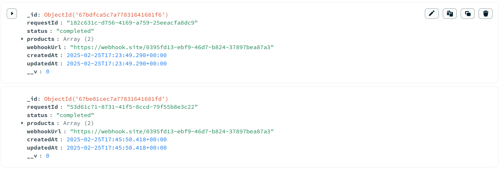

# My Image Processing System: Technical Design Document

## Hey, Here’s What I Built!

So, I created this cool image processing system for my assignment, and I’m pretty pumped about it! Basically, it takes a CSV file full of product names and image URLs, shrinks those images down to 50% quality (to make them load faster), and keeps everything organized in a database. Users get a unique ID to track their stuff, and they can check how it’s going anytime. Oh, and I added a bonus webhook feature—it’s like a little shout-out to tell someone when I’m done. Here’s how it all works!

## What I Wanted to Do

I had a few goals in mind when I started:

- Grab a CSV file with columns like `S. No.`, `Product Name`, and `Input Image Urls`.
- Make sure the CSV isn’t messed up before doing anything with it.
- Shrink the images to half their quality—still look good but way smaller.
- Save all the details (like the new image URLs) in a database so nothing gets lost.
- Give users a way to see what’s happening with their request using a special ID.
- And, for extra credit, ping a webhook when everything’s finished—like a “mission accomplished” text!

## The Pieces of My Puzzle

I broke this down into a few key parts that make the whole thing tick. Here’s what each one does:

### 1. Upload API (The Front Door)

- **Endpoint**: `POST /api/upload`
- **What It Does**: This is where users knock on my app’s door with their CSV file. They can also slip me a `webhookUrl` if they want a heads-up later.
- **How I Made It Work**:
  - I used Multer to catch the uploaded file—it’s gotta be named `csv`, or I’ll freak out (learned that the hard way!).
  - Then, I lean on Papa Parse to read the CSV and make sure it’s got the right stuff: `S. No.`, `Product Name`, and `Input Image Urls`. If it’s missing any of those, I’m like, “Nope, try again!”
  - I whip up a unique `requestId` (think of it like a ticket number) using `uuid`, save everything to MongoDB, and kick off the shrinking process right away (no waiting in line for this version).
- **What You Get**: A quick `{ "requestId": "some-crazy-id" }` so users can keep tabs on their job.

### 2. Image Processing Service (The Shrink Ray)

- **What It Does**: This is the fun part—it grabs big images and zaps them into smaller ones!
- **How I Made It Work**:
  - I use Axios to download each image from the URLs in the CSV—like fetching treasures from the internet.
  - Then, Sharp (this super-fast image tool) steps in, shrinks the image to 50% quality (still looks decent but way lighter), and saves it in my `output/` folder with a random name (like `1740499321061.jpg`—just the timestamp so it’s unique).
  - After that, I figure out the URL (e.g., `http://localhost:3000/output/1740499321061.jpg`) and send it back to be stored.
- **Little Hiccups**: I had to make sure the `output/` folder existed—Windows threw a fit when it didn’t!

### 3. Database Interaction (My Notebook)

- **Tool**: MongoDB—love how flexible it is!
- **What It Holds**: I set up a schema to keep everything tidy:
  - `requestId`: The ticket number for each job.
  - `status`: Starts as `pending`, flips to `completed` when I’m done, or `failed` if something goes wrong.
  - `products`: A list of stuff like `{ serialNo, productName, inputImageUrls, outputImageUrls }`.
  - `webhookUrl`: Optional spot for the “call me back” address. Here it was [ https://webhook.site/0395fd13-ebf9-46d7-b824-37897bea87a3 ]
- **How I Use It**:

  - When the CSV comes in, I save the initial info with empty `outputImageUrls`.
  - As each image shrinks, I update the matching product’s `outputImageUrls` in the database—took me a bit to get that right!
  - Once everything’s shrunk, I mark the `status` as “completed” and save it all.

  

### 4. Status API (The Check-In Desk)

- **Endpoint**: `GET /api/status/:requestId`
- **What It Does**: Lets users peek at their job—like, “Hey, how’s my Teddy Bear doing?”
- **How I Made It Work**:
  - I dig into MongoDB with the `requestId` to find the right record.
  - Then I send back everything: the `requestId`, `status`, and all the `products` with their input and output URLs. It’s like handing them a full report!

### 5. Webhook Handling (The Bonus Bell)

- **What It Does**: Rings a bell at a URL the user gives me when I finish shrinking everything.
- **How I Made It Work**:
  - If there’s a `webhookUrl` in the request, I wait until the `status` hits “completed.”
  - Then I fire off a POST request with Axios, sending a big info packet: `requestId`, `status`, all the `products`, and even a timestamp of when I finished.
  - I added some error handling so if the webhook flops (like a bad URL), I just log it and keep going—no biggie.
- **Cool Touch**: I log what I’m sending and if it works, so I can see it happen in my terminal.

## How It All Flows Together

Here’s the step-by-step of what happens when someone uses my app:

1. They upload a CSV (say, with Teddy Bear and Toy Car pics) to `/api/upload`.
2. I check the CSV’s good, give them a `requestId`, and save it in MongoDB.
3. My shrink ray (image processing) grabs each image, shrinks it, and saves it in `output/`.
4. I update MongoDB with the new URLs for each product as I go.
5. When every image is shrunk, I switch the `status` to “completed” and save it.
6. If they gave me a `webhookUrl`, I send a message like, “Yo, I’m done—here’s everything!”
7. They can hit `/api/status/:requestId` anytime to see the full scoop.

## Tech I Used

I picked some neat tools to build this:

- **Node.js**: The backbone—runs everything.
- **Express**: Makes my APIs easy to set up.
- **Multer**: Grabs the CSV file from the upload.
- **Sharp**: My go-to for shrinking images—super fast!
- **MongoDB**: Keeps all my data safe and organized.
- **Axios**: Handles downloading images and pinging webhooks.
- **Papa Parse**: Parses the CSV so I don’t have to mess with it manually.
- **UUID**: Generates those unique `requestId`s.
